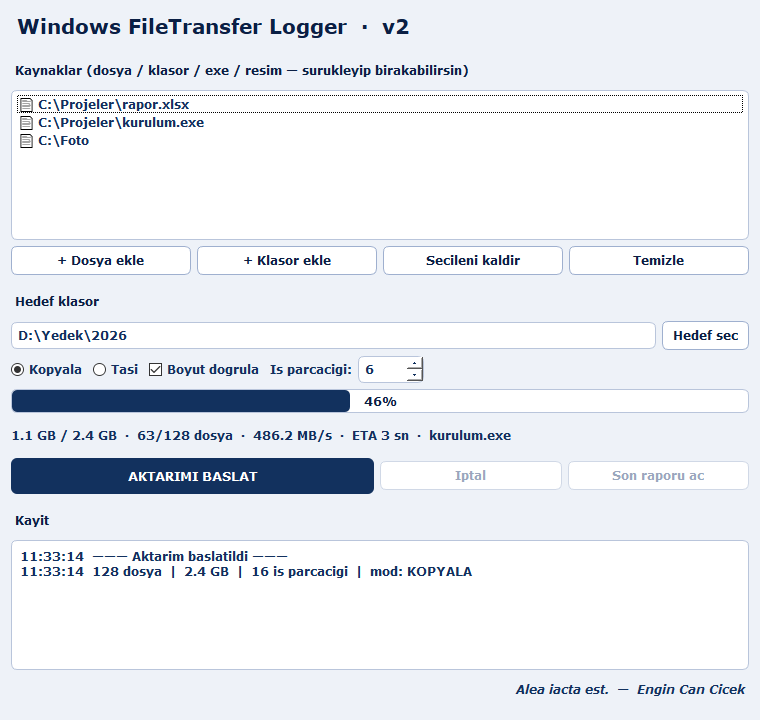

# Windows FileTransfer Logger

> **PyQt6 tabanlı, çok iş parçacıklı dosya/klasör aktarım ve denetim aracı** — her şeyi (dosya, klasör, exe, resim) en hızlı şekilde taşır/kopyalar, loglar ve raporlar.




## v2 — Neler yeni

v1 (Tkinter, tek klasör, tek thread, `shutil.move`) tamamen yeniden yazıldı:

| | v1 | **v2** |
|---|---|---|
| Arayüz | Tkinter | **PyQt6** (gece mavisi, Verdana kalın) |
| Aktarım | tek klasör | **çoklu** dosya + klasör + exe + resim, sürükle-bırak |
| Hız | tek thread | **tüm CPU thread'leri** ile paralel, 8 MB tampon |
| Aynı disk taşıma | kopyala | **anlık `os.replace`** (saniyeler yerine milisaniye) |
| Mod | sadece taşı | **Kopyala / Taşı** + boyut doğrulama |
| Rapor | tek satır log | **oturum başına HTML rapor** + `filetransfer.log` |
| Geri bildirim | belirsiz çubuk | **canlı %, MB/s, ETA, dosya x/y, anlık dosya, iptal** |

## Özellikler

- **Her şeyi aktarır:** birden çok dosya/klasör; klasör yapısı hedefte korunur.
- **En hızlı aktarım:** `ThreadPoolExecutor` ile tüm mantıksal çekirdekler paralel çalışır (özellikle çok dosyalı ve SSD/NVMe aktarımlarda büyük kazanç). İş parçacığı sayısı ayarlanabilir.
- **Akıllı taşıma:** kaynak ve hedef aynı diskteyse dosya kopyalanmaz, anlık taşınır (`os.replace`); farklı diskte kopyala+sil.
- **Denetim izi:** her oturum `filetransfer.log`'a; ayrıca `raporlar/rapor_*.html` içinde dosya başına boyut/süre/hız/durum tablosu.
- **İptal edilebilir**, boyut doğrulamalı, yanıt veren arayüz.

## Kurulum & çalıştırma

```bash
pip install PyQt6
python filetransfer_logger.py
```

## Kullanım

1. **+ Dosya ekle / + Klasör ekle** ya da öğeleri listeye **sürükle-bırak**.
2. **Hedef seç** ile hedef klasörü belirle.
3. **Kopyala / Taşı**, iş parçacığı sayısı ve boyut doğrulamayı ayarla.
4. **AKTARIMI BAŞLAT** — ilerleme, hız ve ETA canlı görünür.
5. Bitince **Son raporu aç** ile HTML raporu görüntüle.

## Tek dosya .exe

```bash
pip install pyinstaller
pyinstaller --onefile --windowed filetransfer_logger.py
```

## Log / rapor formatı

- `filetransfer.log`: `2026-07-07 18:21:33 - INFO - BASLADI mod=copy dosya=128 ...`
- `raporlar/rapor_YYYYmmdd_HHMMSS.html`: özet kartları + dosya başına tablo.

## Notlar

- Yalnızca **Windows** hedeflenir; `os.replace` hızlı yolu aynı NTFS birimi içindir.
- Eski Tkinter sürümü `Windows-FileTransfer-Logger.py` olarak geçmişte kalır.

---
*Alea iacta est.* — Engin Can Cicek
